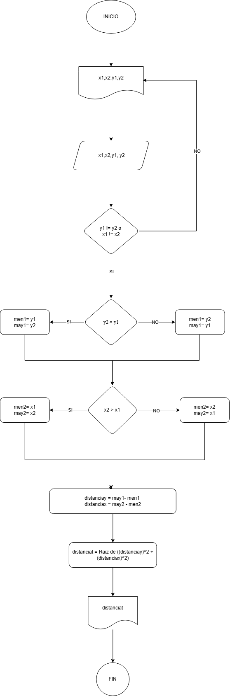
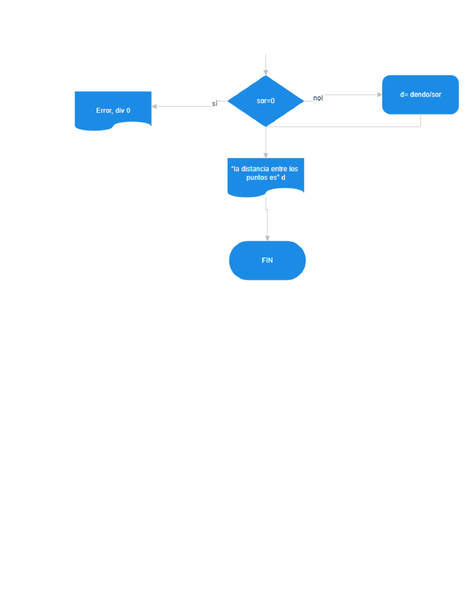

**Reto1**
---
pseudocódigo

    1. INICIO 
    2. Escribir x1, y1, x2, y2 
    3. Leer x1, y1, x2, y2 
    4. Mientras y2 = y1 o x1 = x2
    5.  Escribir y2, x2
    6. fin del mientras
    7.  si y2>y1 
    8.   men1= y1 
    9.   may1= y2 
    10.  si no 
    11.   men1= y2 
    12.   may1= y1
    13. fin del si 
    14. Si x2>x1 
    15.  men2= x1 
    16.     may2= x2 
    17.     si no 
    18.    men2= x2 
    19.    may2= x1 
    20. fin del si 
    21. distaciay= may1 – men1 
    22. distanciax= may2 - men2 
    23. distaciat= Raiz de ((distanciay)^2 + (distanciax)^2)
    24. Escribir distanciat
    25. FIN
---
- 
-  

 
 
