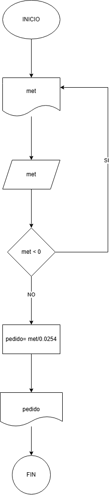

**Reto2**
---
Pseudocódigo 

    01. INICIO 
    02. Escribir met
    03. Leer met
    04. Si met<0
    05. 	Escrbir Error, solo números positivos
    06. Si no 
    07. 	Pedido=met/0.0254 
    08. Escribir “la cantidad en pulgadas que debe pedir es {pedido}"
    09. FIN
---  
- 