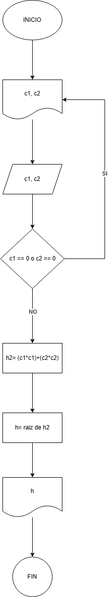

**Reto 3**
- Pseudocódigo
"""
01. INICIO 
02. Leer c1, c2 
03. Sí c1=0 ó c2=0 
04. 	Escribir “error no es un triángulo”
05. Si no 
06. 	h2= (c1*c1)+(c2*c2)
07. 	h= raiz.h2  
08. fin del si 
09. escribir “la hipotenusa es” h 
10. FIN 
"""
- 